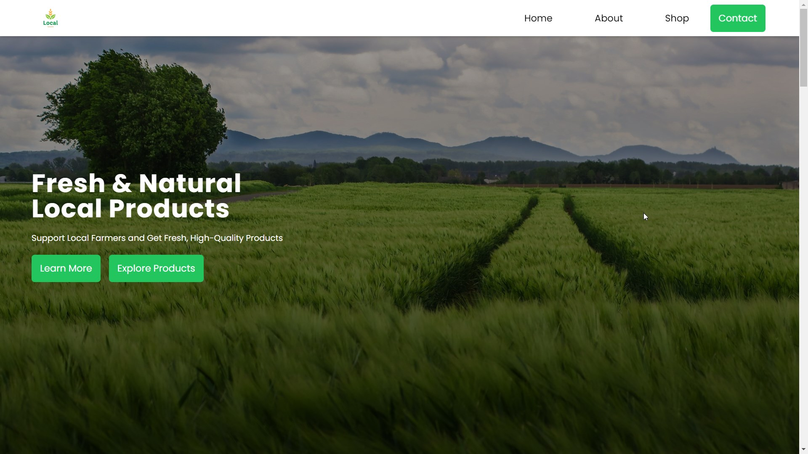
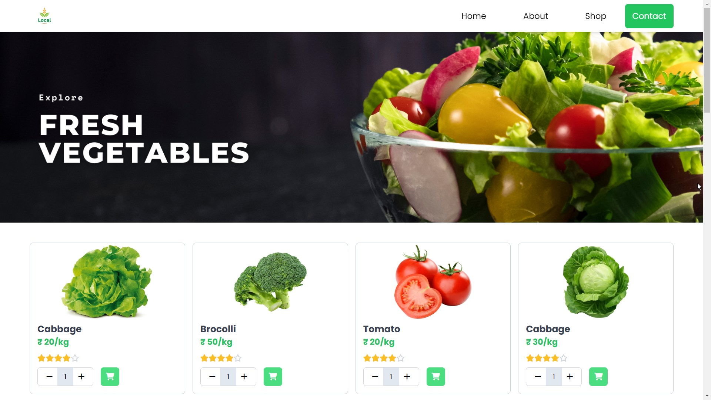
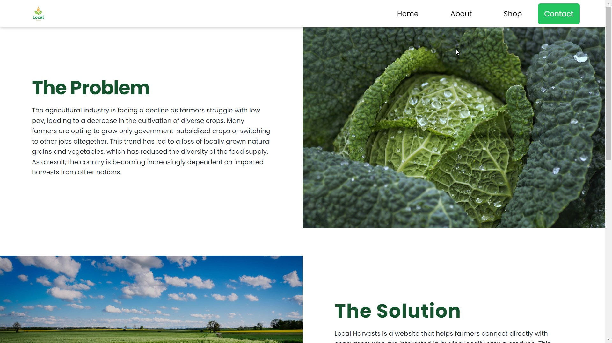

# Local Harvests 🌾

> Find the live website [here](https://localharvests.netlify.app)

 1️⃣  |   2️⃣
:-------------------------:|:-------------------------:
 |  
  | -

## Problem Statement

The agricultural industry is facing a decline as farmers struggle with low pay, leading to a decrease in the cultivation of diverse crops. Many farmers are opting to grow only government-subsidized crops or switching to other jobs altogether. This trend has led to a loss of locally grown natural grains and vegetables, which has reduced the diversity of the food supply. As a result, the country is becoming increasingly dependent on imported harvests from other nations.

## Solution

Local Harvests is a website designed to help farmers overcome the challenges they face in accessing markets and getting fair prices for their products. By listing their products on the website, farmers have a direct channel to consumers who are interested in buying locally grown produce.

- Farmers can set their own prices for their products, which means they have more control over their income and are not limited by the prices set by middlemen or retailers. This can help increase farmers' incomes and improve their livelihoods.
- In addition, Local Harvests works with a network of delivery partners to ensure that farmers can get their products to consumers quickly and efficiently. This eliminates the need for farmers to travel long distances to markets, which can be time-consuming and costly.
- By facilitating direct connections between farmers and consumers, Local Harvests can also help increase the diversity of the food supply. Consumers can access a wider range of locally grown natural grains and vegetables, which can help reduce the country's dependence on imported harvests from other nations.
- Furthermore, Local Harvests can help improve infrastructure and market access issues faced by farmers. By creating a platform for farmers to list their products and connect with consumers, Local Harvests is effectively creating a new market for farmers that did not previously exist. This can help address the issue of limited access to markets and help farmers reach a wider audience.
- Overall, Local Harvests can be a powerful tool for improving the livelihoods of farmers, increasing the diversity of the food supply, and addressing some of the challenges faced by the agricultural industry.

## About Local Harvests

- Local Harvests is a game-changing online marketplace that revolutionizes the way farmers and customers connect, offering a sophisticated platform that allows for a seamless and sustainable exchange of **fresh, locally grown produce**. With a user-friendly interface, farmers can effortlessly create profiles, showcasing their products with stunning images, vivid descriptions, and unbeatable prices.

- Customers are treated to an **immersive shopping experience**, with a vast selection of products that can be easily browsed through by category, location, and price range. Notably, the platform also highlights new and featured products, providing exciting opportunities for shoppers to discover something new.

- The website takes pride in its **secure payment options**, which include credit cards and Razer Pay, and UPI ensuring that transactions are seamless, straightforward, and trustworthy. Once an order has been placed, farmers receive a prompt notification, and they can coordinate with the customer for delivery or pickup, whichever suits them best.

- One of the website's most compelling features is its **review system**, which encourages customers to provide feedback on their experience with the farmers and products. This fosters a culture of transparency and accountability, strengthening the **bond between farmers and customers** and creating a community that values quality and sustainability.

>  In summary, Local Harvests is a dynamic and cutting-edge platform that empowers farmers to reach a wider audience, while also providing customers with unparalleled access to fresh, locally grown produce. With its elegant interface, secure payment options, and community-focused approach, the website is a game-changer in the world of online marketplaces, offering a uniquely immersive and satisfying shopping experience.

## Full Walkthrough

